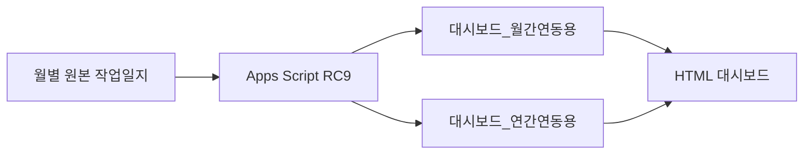

# 양돈장 종합관리 프로그램 — 프로젝트 현황

- 기준일: 2026-09-19
- 현재 Apps Script: `Code.gs v11.5-RC9`
- 코드 저장소: `mambug-lab/pig-farm-dashboard`
- 문서 관리 원칙: 이 문서는 현재 상태만 기록하고, 과거 변경 내역은 `CHANGELOG.md`에 누적한다.

## 1. 현재 결론

RC9은 테스트 통합문서의 자동 월 생성 검증을 통과했고, 원본 작업일지의 Apps Script에도 적용됐다. 사용자는 RC9을 GitHub에 저장했다.

원본에서 `refreshDashboardLinks()`를 실행한 결과 월간·연간 연동 갱신이 오류 없이 완료됐다. 현재 원본의 최신 유효 작업일은 2026-08-26이며, 8월 유효 작업일은 26일이다.

RC9 코드 적용과 연동 시트 갱신은 완료됐다. 다음 단계는 대시보드 표시 수치의 정확성 검증과 자동 월 생성 트리거의 설치·시간대·실행 동작 검증이다.

## 2. 현재 운영 구조

| 구성요소 | 현재 상태 |
| --- | --- |
| 월별 원본 작업일지 | 2026년 5~12월 탭 존재 |
| Apps Script | RC9 원본 적용 완료 |
| 월간 연동 시트 | 원본 실행으로 갱신 완료 |
| 연간 연동 시트 | 원본 실행으로 갱신 완료 |
| 실사 입력 | J열 상세 실사 및 `Инвентаризация поголовья` 구분 합계 실사 지원 |
| 자동 월 생성 | 코드와 테스트 검증 완료, 운영 트리거 검증 필요 |
| 대시보드 HTML | 기존 F-01 대응 HTML 사용 상태 확인 필요 |
| GitHub | 사용자 확인 기준 RC9 저장 완료, 이 문서에서 커밋 SHA는 확인하지 않음 |

## 3. RC9 변경 내용

RC8은 2월처럼 짧은 달을 만들 때 29~31일 날짜 블록을 삭제했지만, 그 뒤의 날짜 없는 예비 일지를 남겼다. 예비 일지의 수식이 삭제된 행을 참조하면서 `#REF!`가 발생했다.

RC9은 새 월 시트에서 마지막 날짜 뒤의 무날짜 예비 블록을 먼저 제거한 다음, 대상 월에 없는 날짜 블록을 삭제한다. 원본 월 시트와 숨김 템플릿의 구조는 변경하지 않는다.

최종 RC9에는 다음 테스트 전용 항목이 포함되지 않는다.

- 테스트 통합문서 이름과 ID
- 테스트용 셀 `E1183 = 0`
- 테스트용 2027년 1·2월 고정 참조
- 테스트 백업 시트 이름
- `runRC9LiveVerification()` 임시 검증 함수

RC9은 바운드된 통합문서를 `SpreadsheetApp.getActiveSpreadsheet()`로 읽으므로, 원본 Apps Script에 적용하면 원본 작업일지를 대상으로 동작한다.

## 4. 완료된 검증

### 4.1 로컬 회귀검사

- 총 62건 통과
- 실패 0건
- 날짜 표시값 우선 처리
- 28·29·30·31일 월 생성
- F-01/F-03 실사보정
- 연도 경계 이월
- 월 생성 중 UI를 사용할 수 없는 실행 문맥의 오류 처리
- 중복 월 생성 방지
- 총계 이후 메모·서명 영역의 이월 대상 제외
- RC8의 예비 영역 `#REF!` 재현 및 RC9 수정 확인

### 4.2 실제 Google Sheets 테스트

폐기 가능한 테스트 사본에서 2027년 2월을 자동 생성해 다음 결과를 확인했다.

| 항목 | 결과 |
| --- | ---: |
| 날짜 블록 | 28개 |
| 날짜 범위 | 2027-02-01~2027-02-28 |
| J열 머리글 | 28개 정상 |
| 이월 상세 재고 | 12개 항목 |
| 이월 합계 | 5,367두 |
| 생성 시트 수식 오류 | 0건 |
| 같은 월 재요청 | 중복 생성 없음 |
| 작업 기록 없는 2월에서 3월 생성 요청 | 안전하게 차단 |
| 월간·연간 대시보드 연동 | 갱신 완료 |

작업 기록이 없는 전월에서 다음 달 생성을 차단하는 오류는 의도된 안전장치다. 이를 피하기 위한 가짜 작업 입력은 사용하지 않는다.

### 4.3 원본 작업일지 적용

원본 Apps Script에 RC9을 적용하고 `refreshDashboardLinks()`를 실행했다.

| 항목 | 결과 |
| --- | --- |
| 실행 시간 | 2026-09-19 11:38:19~11:38:33 |
| 종료 상태 | 오류 없이 완료 |
| 월간 연동 대상 | Август 2026 |
| 최신 유효 작업일 | 2026-08-26 |
| 8월 유효 작업일 | 26일 |
| 최신 날짜행 | 976 |
| 다음 날짜행 | 1015 |
| 복사 종료행 | 1014 |
| 검출 앵커 | 4개 |
| 직접입력 앵커 | 3개 |
| 연간 출력 | 4,626행 |

테스트 사본에서 사용한 8월 27일의 값은 원본으로 옮겨지지 않았다. 원본 최신 유효일이 8월 26일인 결과와 일치한다.

## 5. 기존 데이터 확인 사항

다음 월 경계 차이는 RC9 적용으로 새로 발생한 오류가 아니다. 기존 수동 월 탭의 첫날 재고 입력 또는 실측 재설정 내역을 확인해야 한다.

| 월 경계 | 전월 말 | 다음 달 초 | 차이 |
| --- | ---: | ---: | ---: |
| 5월→6월 | 5,241 | 5,254 | +13 |
| 6월→7월 | 5,410 | 5,451 | +41 |
| 7월→8월 | 5,418 | 5,451 | +33 |
| 8월→9월 | 5,430 | 5,367 | -63 |

원본 데이터에 존재하는 음수 상세 재고 등은 근거 없이 자동 수정하지 않는다. 월 경계 차이도 현장 자료와 확인한 뒤 별도 보정한다.

## 6. 다음 검증 단계

### 6.1 대시보드 표시 수치 정확성

원본 작업일지, 월간 연동 시트, 연간 연동 시트, HTML 대시보드의 값을 같은 기준일로 대조한다.

검증 대상:

1. 최신 유효 작업일
2. 총 사육두수와 모돈수
3. 당일 판매·폐사
4. 월 누적 판매·폐사
5. 연간 누적 판매·폐사
6. 평균 모돈수
7. 누적 예상 MSY와 계산 기간
8. F-01 공식 그룹재고·상세재고·잔차 표시
9. F-03 후속 J열 입력에 따른 잔차 종료
10. 한국어·러시아어 화면의 동일 수치 표시

완료 조건은 원본에서 독립 계산한 값과 연동 시트 및 화면 표시값이 일치하는 것이다.

### 6.2 자동 월 생성 트리거

검증 대상:

1. Apps Script 프로젝트 시간대가 `Asia/Vladivostok`인지 확인
2. `createCurrentMonthSheetOnFirstDay` 설치형 트리거 존재 여부
3. 매월 1일 01시경 실행 설정 확인
4. 중복 트리거 여부
5. 최근 실행 기록과 성공·실패 원인
6. 월 시트가 이미 있을 때 중복 생성하지 않는지 확인
7. 전월에 유효 작업일이 없을 때 다음 달 생성을 차단하는지 확인
8. 생성 실패 시 불완전한 신규 시트를 제거하는지 확인
9. 생성 성공 시 날짜 수, D열 이월, J열 설정 및 대시보드 갱신 확인

실제 다음 달 시트를 불필요하게 생성하지 않고, 우선 트리거 구성과 실행 기록을 읽기 전용으로 확인한다.

## 7. 승격 및 운영 판단

RC9은 원본 적용 후 연동 갱신까지 정상 완료했으므로 현재 Apps Script 기준본으로 사용할 수 있다.

다음 항목이 완료되면 대시보드와 자동화 전체에 대한 운영 검증을 마칠 수 있다.

- 대시보드 표시 수치의 원본 대조
- F-01/F-03 화면 반영 확인
- 자동 월 생성 트리거 구성 및 실행 이력 확인
- 기존 월 경계 불일치의 원인 분류
- 필요 시 `PROJECT_STATUS.md`, `CHANGELOG.md`, `SHEET_STRUCTURE.md` 갱신

## 8. 문서 관리 규칙

- `PROJECT_STATUS.md`: 현재 상태와 다음 작업만 유지한다.
- `CHANGELOG.md`: 날짜별 변경·검증 이력을 누적한다.
- `SHEET_STRUCTURE.md`: 실제 시트 구조 또는 연결 규약이 변경된 경우 갱신한다.
- 코드 버전명, 파일 저장, GitHub 커밋, Apps Script 적용, 실행 성공 및 화면 검증을 서로 구분해 기록한다.

