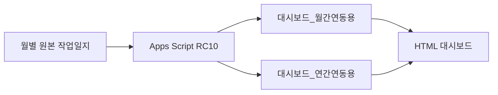

# 양돈장 종합관리 프로그램 — 프로젝트 현황

- 기준일: 2026-09-23
- 현재 Apps Script: `Code.gs v11.5-RC10`
- 코드 저장소: `mambug-lab/pig-farm-dashboard`
- 문서 관리 원칙: 이 문서는 현재 상태만 기록하고, 과거 변경 내역은 `CHANGELOG.md`에 누적한다.

## 1. 현재 결론

RC10은 독립 테스트 사본의 월 경계 연속성과 트리거 실발화 검증을 통과했고, 운영 Apps Script에 적용됐다.

원본에서 `refreshDashboardLinks()`를 실행한 결과 월간·연간 연동 갱신이 오류 없이 완료됐다. 현재 원본의 최신 유효 작업일은 2026-08-26이며, 8월 유효 작업일은 26일이다.

RC10 코드 적용, 연동 시트 갱신, 운영 트리거 4개 설치를 완료했다. 다음 정규 매월 1일 예약 발화와 실제 신규 월 생성은 실행 시점에 이력으로 추가 확인한다.

## 2. 현재 운영 구조

| 구성요소 | 현재 상태 |
| --- | --- |
| 월별 원본 작업일지 | 2026년 5~12월 탭 존재 |
| Apps Script | RC10 운영 적용 완료 |
| 월간 연동 시트 | 원본 실행으로 갱신 완료 |
| 연간 연동 시트 | 원본 실행으로 갱신 완료 |
| 실사 입력 | J열 상세 실사 및 `Инвентаризация поголовья` 구분 합계 실사 지원 |
| 자동 월 생성 | 운영 트리거 설치 완료, 다음 정규 발화 확인 예정 |
| 대시보드 HTML | RC10 공식 그룹재고 표시 반영 |
| GitHub | RC10 코드·HTML·검증 기록 저장 |

## 3. RC10 변경 내용

RC10은 관리사무소 대장 `Инвентаризация поголовья`의 그룹 재고를 공식 기준으로 유지한다. 월초 수기 D열과 현장 J열은 원자료로 보존하며, 새 수기 월 탭이 시작돼도 공식 재고를 초기화하지 않는다.

대시보드 HTML은 공식 그룹재고, 상세 돈방 합계, 미배분 보정잔차를 구분해 표시한다. 공식 메타가 누락되거나 최신 유효일과 맞지 않으면 잘못된 수치를 표시하는 대신 오류로 중단한다.

편집·변경 이벤트는 갱신 요청만 기록하고, 5분 재시도 트리거가 잠금 경합이나 일시 오류 뒤의 요청을 처리한다. 월 생성 트리거는 블라디보스토크 시간대로 매월 1일 01시경 실행된다.

## 4. 완료된 검증

### 4.1 로컬 회귀검사

- 총 75건 통과
- 실패 0건
- 대장 우선 공식 재고와 월 경계 연속성
- 상세 J값과 공식 그룹재고의 분리
- 28·29·30·31일 월 생성과 연도 경계 이월
- 트리거 설치 멱등성, 잠금 경합, 오류 후 재시도
- HTML 공식 메타 계약과 한국어·러시아어·조선어 표시

### 4.2 실제 Google Sheets 테스트

독립 테스트 사본에서 `refreshDashboardLinks()`를 실행해 5월→6월 5,258두, 6월→7월 5,399두, 7월→8월 5,366두로 공식 재고가 이어지는 것을 확인했다. 편집·변경·5분 재시도와 임시 월 생성 트리거가 실제 완료됐고 오류율은 0%였다. 테스트용 트리거 5개는 검증 후 모두 삭제했다.

### 4.3 운영 적용

운영 Apps Script에 RC10을 저장하고 트리거 4개를 설치한 뒤 `refreshDashboardLinks()`를 실행했다.

| 항목 | 결과 |
| --- | --- |
| 종료 상태 | 오류 없이 완료 |
| 월간 연동 대상 | Август 2026 |
| 최신 유효 작업일 | 2026-08-26 |
| 8월 유효 작업일 | 26일 |
| 복사 종료행 | 1014 |
| 연간 출력 | 4,626행 |
| 운영 트리거 | 4개, 중복 없음 |

상세 기록은 [`RC10_LIVE_VALIDATION_2026-09-23.md`](RC10_LIVE_VALIDATION_2026-09-23.md)에 있다.

## 5. 기존 데이터 확인 사항

다음 월 경계 차이는 RC10 적용으로 새로 발생한 오류가 아니다. 기존 수동 월 탭의 첫날 재고 입력 또는 실측 재설정 내역을 확인해야 한다.

| 월 경계 | 전월 말 | 다음 달 초 | 차이 |
| --- | ---: | ---: | ---: |
| 5월→6월 | 5,241 | 5,254 | +13 |
| 6월→7월 | 5,410 | 5,451 | +41 |
| 7월→8월 | 5,422 | 5,451 | +29 |
| 8월→9월 | 5,430 | 5,371 | -59 |

원본 데이터에 존재하는 음수 상세 재고 등은 근거 없이 자동 수정하지 않는다. 월 경계 차이도 현장 자료와 확인한 뒤 별도 보정한다.

## 6. 다음 검증 단계

### 6.1 대시보드 표시 수치 정확성

원본 작업일지, 월간 연동 시트, 연간 연동 시트, HTML 대시보드의 값을 같은 기준일로 대조한다.

검증 대상:

1. 최신 유효 작업일
2. 총 사육두수와 모돈수
3. 당일 판매·폐사
4. 월 누적 판매·폐사
5. 연간 누적 판매·폐사
6. 평균 모돈수
7. 누적 예상 MSY와 계산 기간
8. F-01 공식 그룹재고·상세재고·잔차 표시
9. F-03 후속 J열 입력에 따른 잔차 종료
10. 한국어·러시아어 화면의 동일 수치 표시

완료 조건은 원본에서 독립 계산한 값과 연동 시트 및 화면 표시값이 일치하는 것이다.

### 6.2 자동 월 생성 트리거

검증 대상:

1. Apps Script 프로젝트 시간대가 `Asia/Vladivostok`인지 확인
2. `createCurrentMonthSheetOnFirstDay` 설치형 트리거 존재 여부
3. 매월 1일 01시경 실행 설정 확인
4. 중복 트리거 여부
5. 최근 실행 기록과 성공·실패 원인
6. 월 시트가 이미 있을 때 중복 생성하지 않는지 확인
7. 전월에 유효 작업일이 없을 때 다음 달 생성을 차단하는지 확인
8. 생성 실패 시 불완전한 신규 시트를 제거하는지 확인
9. 생성 성공 시 날짜 수, D열 이월, J열 설정 및 대시보드 갱신 확인

실제 다음 달 시트를 불필요하게 생성하지 않고, 우선 트리거 구성과 실행 기록을 읽기 전용으로 확인한다.

## 7. 승격 및 운영 판단

RC9은 원본 적용 후 연동 갱신까지 정상 완료했으므로 현재 Apps Script 기준본으로 사용할 수 있다.

다음 항목이 완료되면 대시보드와 자동화 전체에 대한 운영 검증을 마칠 수 있다.

- 대시보드 표시 수치의 원본 대조
- F-01/F-03 화면 반영 확인
- 자동 월 생성 트리거 구성 및 실행 이력 확인
- 기존 월 경계 불일치의 원인 분류
- 필요 시 `PROJECT_STATUS.md`, `CHANGELOG.md`, `SHEET_STRUCTURE.md` 갱신

## 8. 문서 관리 규칙

- `PROJECT_STATUS.md`: 현재 상태와 다음 작업만 유지한다.
- `CHANGELOG.md`: 날짜별 변경·검증 이력을 누적한다.
- `SHEET_STRUCTURE.md`: 실제 시트 구조 또는 연결 규약이 변경된 경우 갱신한다.
- 코드 버전명, 파일 저장, GitHub 커밋, Apps Script 적용, 실행 성공 및 화면 검증을 서로 구분해 기록한다.
